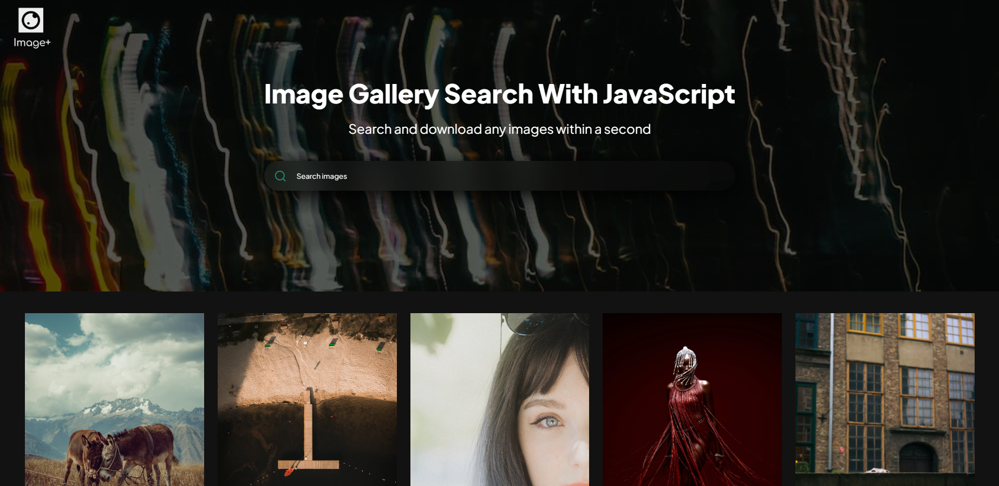

# Image+ : Image Gallery Search With JavaScript

Image+ is a powerful web application that offers a lightning-fast image search and download experience. With its intuitive interface and cutting-edge technology, users can quickly find and download their desired images from a vast collection. Whether you're a designer, content creator, or just someone looking for high-quality images, Image+ has got you covered.

## Live Demo

Experience Image+ in action with our [Live Demo](https://n1khilnick.github.io/imagePlus/). Explore the image search and download process before using it in your own projects!

## Key Features

- **Instant Search**: Image+ leverages JavaScript to provide real-time search results as you type. Say goodbye to slow loading times and enjoy instant search feedback.

- **Extensive Image Gallery**: Our curated image gallery houses a diverse range of images to suit various needs. From stunning landscapes to abstract textures, you'll find it all in one place.

- **Effortless Download**: Downloading images is a breeze with Image+. A single click and your chosen image is ready to enhance your projects.

- **Responsive Design**: Whether you're on a desktop, tablet, or smartphone, Image+ adapts seamlessly to your screen size, ensuring a consistent and enjoyable experience across devices.

- **Lightweight**: We understand the importance of performance. Image+ is designed to be lightweight, ensuring swift loading times and smooth navigation.

## How to Use

Using Image+ is incredibly simple:

1. **Search**: On the homepage, enter keywords related to the image you're looking for. The search results will update in real-time as you type.

2. **Browse**: Scroll through the search results to explore the images available. Each image is accompanied by a preview to help you make the right choice.

3. **Download**: Once you've found the perfect image, click on the "Download" button. The image will be instantly saved to your device.

## Installation

To get started with Image+, follow these steps:

1. Clone this repository: `git clone https://github.com/yourusername/image-plus.git`

2. Navigate to the project directory: `cd image-plus`

3. Open the `index.html` file in your preferred web browser.

That's it! You're ready to start using Image+ and revolutionize the way you search and download images.

## Contributing

We welcome contributions to make Image+ even better. If you're interested in adding new features, improving performance, or fixing issues, please follow these steps:

1. Fork the repository.

2. Create a new branch: `git checkout -b feature-new-feature`

3. Make your modifications and improvements.

4. Test thoroughly to ensure everything works as expected.

5. Commit your changes: `git commit -m "Add new feature"`

6. Push to the branch: `git push origin feature-new-feature`

7. Open a pull request detailing your changes.

## Feedback and Support

If you encounter any issues while using Image+ or have suggestions for improvement, please [open an issue](https://github.com/yourusername/image-plus/issues). We're here to help and enhance the user experience.

For general inquiries or assistance, feel free to contact our support team at support@imageplusapp.com.

---

Discover the future of image searching and downloading with Image+. Transform the way you work with images and embrace a faster, more efficient workflow. Try Image+ today and elevate your projects with stunning visuals.
